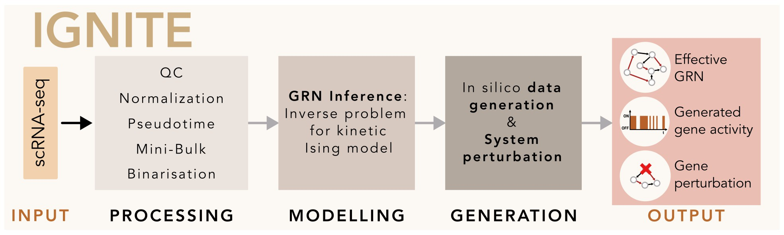

# Unveiling Gene Perturbation Effects through Gene Regulatory Networks Inference from Single-Cell Transcriptomic Data

This repository contains the code used to generate the results presented in the pre-print manuscript "Unveiling Gene Perturbation Effects through Gene Regulatory Networks Inference from single-cell transcriptomic data" by Corridori et al., 2024 ([link to the pre-print](https://www.biorxiv.org/content/10.1101/2024.05.10.593314v1)). It presents IGNITE (Inference of Gene Networks using Inverse kinetic Theory and Experiments) – a machine learning framework that infers Gene Regulatory Networks (GRNs) from unperturbed single-cell RNA sequencing data and predicts gene perturbations!

Overview of the IGNITE framework used for inferring Gene Regulatory Networks:

## Repository Structure

The repository is organized into three main directories, each focusing on different stages of the analysis:

### 1. `preprocessing`
This directory includes R notebooks (`.Rmd` files) for preprocessing single-cell RNA-seq (scRNA-seq) data. The preprocessing steps covered in these notebooks include quality control, normalization, dimensionality reduction, clustering, and pseudotime analysis.

### 2. `IGNITE_and_SCODE_notebooks`
This directory contains Jupyter notebooks to be run with Python for inferring GRNs from the preprocessed scRNA-seq data using two methods: IGNITE (developed by our team) and SCODE ([Matsumoto et al., 2017](https://academic.oup.com/bioinformatics/article/33/15/2314/3100331), a state-of-the-art inference method). The notebooks also provide a performance evaluation of both methods, focusing on their predictive accuracy for single and triple gene knockouts.

### 3. `CellOracle_notebooks`
This directory holds Jupyter notebooks to be run with Python for testing the CellOracle model ([Kamimoto et al., 2023](https://www.nature.com/articles/s41586-022-05688-9)), another state-of-the-art method for predicting gene perturbation effects. The performance of CellOracle is evaluated using the same scRNA-seq dataset.

## Dataset
All methods were tested on murine pluripotent stem cells (PSCs) transitioning from the naive to the formative state. We used a 10X scRNA-seq dataset with 5 time points and we focused on 24 genes known from literature as relevant in the naive to formative transition.

For more details on the methods and results, please refer to the pre-print manuscript: [Corridori et al., 2024](https://www.biorxiv.org/content/10.1101/2024.05.10.593314v1).